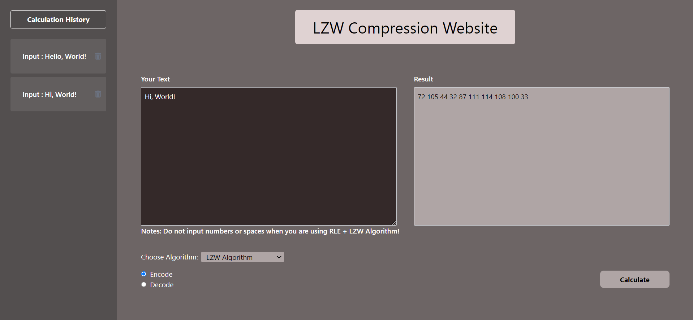

# LZW WebApp
LZW Compression WebApp
 

## Table of Contents
* [General Info](#general-information)
* [WebApp View](#webapp-view)
* [Additional Info](#additional-info)
* [Tech Stack](#tech-stack)
* [Credits](#credits)

## General Information
This web is for compressing text. The algorithms that can be used on this website are the LZW (Lempel-Ziv-Welch) algorithm, the MTF (Move-to-Front) + LZW algorithm, and the RLE (Run-Length-Encoding) + LZW algorithm.

## WebApp View
> 

## Additional Info
In this website, there are three algorithm variations that are used, which are the LZW (Lempel-Ziv-Welch) algorithm, the MTF (Move-to-Front) + LZW algorithm, and the RLE (Run-Length-Encoding) + LZW algorithm. For the LZW algorithm, the encoding and decoding process is done using the encode and decode functions, which are in the lzw.js file in the backend/utils folder. For the MTF + LZW algorithm, in the encoding process, the encoding is carried out first using the mtfEncode function from the mtf.js file in the backend/utils folder and then with the LZW encode function. As for the decoding process, decoding is done first with the LZW decode function and then with the mtfDecode function from the mtf.js file. Finally, for the RLE + LZW algorithm, in the encode process, the encoding is also carried out first using the rleEncode function from the rle.js file in the backend/utils folder and then with the LZW encode function. Meanwhile, for the decoding process, decoding is done first with the LZW decode function and then with the rleDecode function from the rle.js file.

## Tech Stack
### Front End
* React
### Back End
* Node + Express
* MongoDB

## Credits
This project is implemented by Bill Clinton (13521064).
